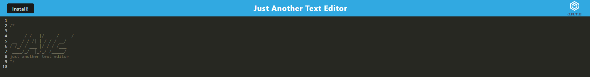
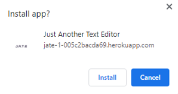

# jate

## Description

JATE stands for Just Another Text Editor. As indicated by the name, it is just that: a text editor, however: JATE is also a PWA, so it can also be downloaded onto your local machine!

## Installation

First, head to the deployed Heroku application link: https://jate-1-005c2bacda69.herokuapp.com/

Upon clicking this link, you should be greeted with this display:

The application can be installed utilizing the "Install" button in the top left, or used in a browser.

## Usage

Upon clicking the "Install" button, you will be greeted with this prompt:

Install the program, then you can use it as a normal text editor!

## Credits

Stack Overflow Forums: https://stackoverflow.com/
MDN PWA Docs: https://developer.mozilla.org/en-US/docs/Web/Progressive_web_apps/Tutorials/js13kGames/Installable_PWAs
Webpack Docs: https://webpack.js.org/configuration/
